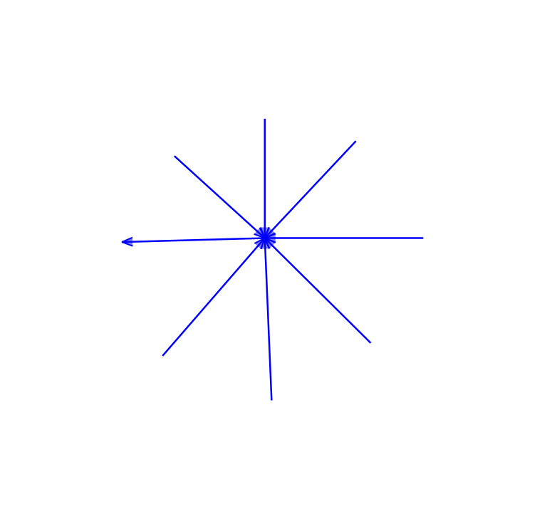
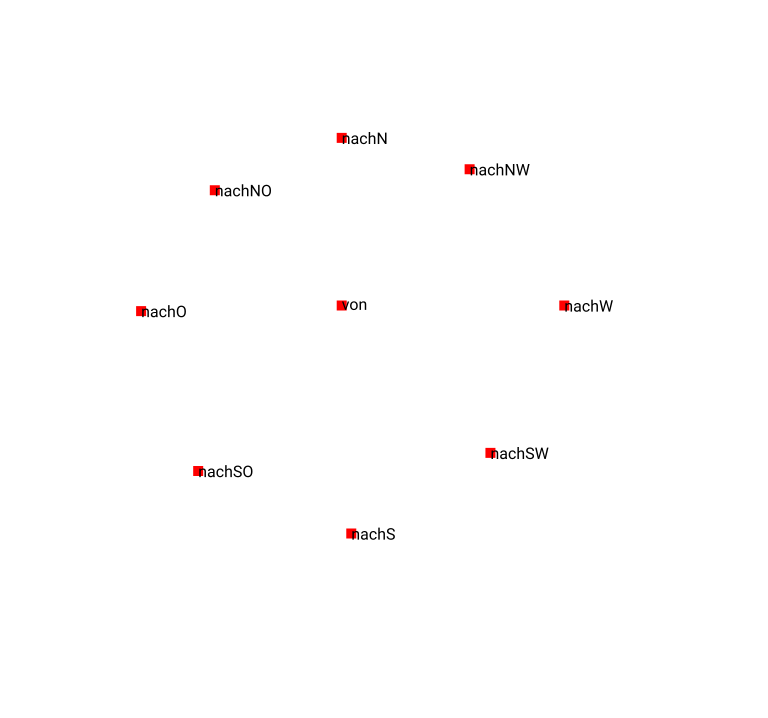
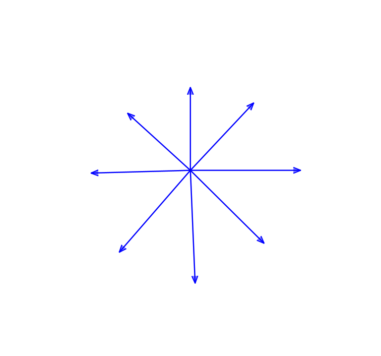
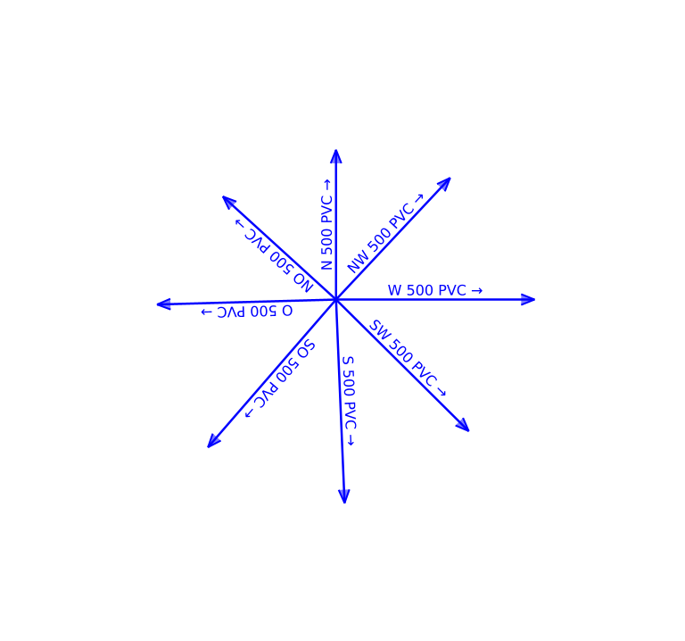
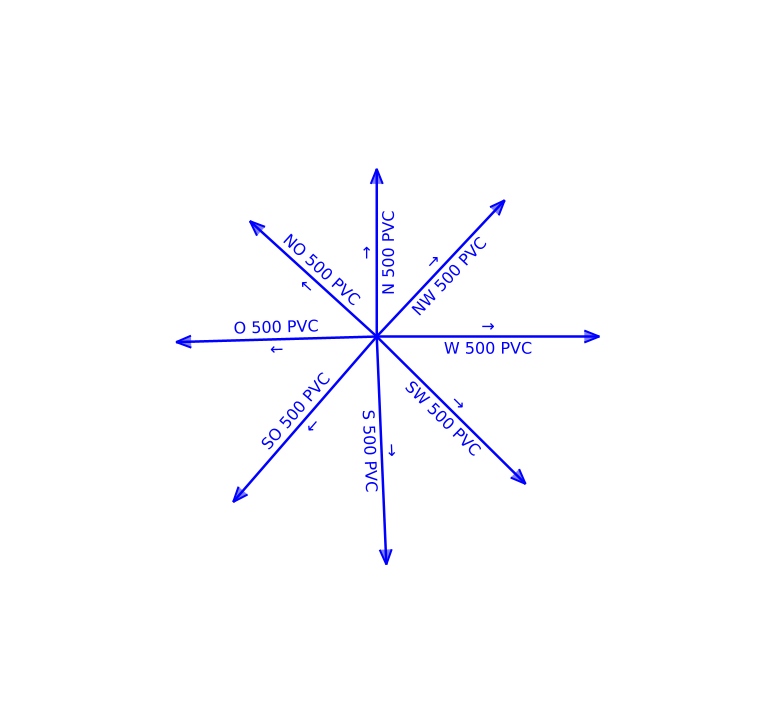

# Fliessrichtungssymbole

Die Leitung (die Polyline) kennt im Datenmodell die Fliessrichtung nicht. Auf dem Plan und im Web GIS Client soll zwecks besserer Interpretation ein Fliessrichtungssymbol gezeichnet werden. 

Die Fliessrichtung steckt in der Topologie, welche im Modell mit zwei Assoziationen (Leitung <-> von/nach Knoten) modelliert ist, errechnet werden. Die Definition der Leitungsgeometrie wird nach dem Datenimport falls nötig umgedreht (`ST_Reverse(geom)`). Dies ist der Fall, falls `ST_StartPoint(verlauf)` nicht der "von"-Knoten-Koordinate entspricht.

Achtung: 
- Die hier verwendete SQL-Query behandelt nur den einfachsten Fall. Wahrscheinlich gibt es verschiedenste Corner Cases. Wohl auch abhängig von der Qualität der Daten (fehlende Geometrien etc. pp.).
- Die Schriftart muss ein Pfeilsymbol enthalten. Bei Roboto scheint das nicht der Fall zu sein. Es wurde DejaVu Sans verwendet.

TODO:
- Überprüfen, ob die VendorOption tatsächlich das macht, was ich meine und damit garantiert, dass das Fliessrichtungssymbol korrekt orientiert ist.


## Import
```
java -jar /Users/stefan/apps/ili2pg-4.4.2/ili2pg-4.4.2.jar \
--dbschema vsadssmini_arrow --models VSADSSMINI_2020_LV95 --modeldir "https://vsa.ch/models;http://models.geo.admin.ch" \
--defaultSrsCode 2056 --createGeomIdx --sqlEnableNull --createUnique --createEnumTabs --beautifyEnumDispName --createNumChecks --nameByTopic --strokeArcs \
--createscript vsadssmini_arrow.sql
```

```
java -jar /home/stefan/apps/ili2pg-4.4.2/ili2pg-4.4.2.jar \
--dbhost localhost --dbport 54321 --dbdatabase edit --dbusr admin --dbpwd admin \
--dbschema vsadssmini_arrow --models VSADSSMINI_2020_LV95 --modeldir "https://vsa.ch/models;http://models.geo.admin.ch" \
--defaultSrsCode 2056 --createGeomIdx --sqlEnableNull --createUnique --createEnumTabs --beautifyEnumDispName --createNumChecks --nameByTopic --strokeArcs \
--disableValidation \
--import arrow.xtf
```

## Daten
Die Daten ([`arrow.xtf`](arrow.xtf)) enthalten 9 Knoten und 8 Leitungen. 7 der 8 Leitungen sind entgegen der in den Daten (mittels Assoziationen) erfassten Topologie digitalsiert. In der Mitte befindet sich der "von"-Knoten. In 8 Richtungen (N,W,S,O,NW,SW,SO,NO) gibt es 8 "nach"-Knoten. Folgende Bilder illustrieren die Ausgangslage.

Der "technische" Endpunkt einer Leitungsgeometrie wird mit einem Pfeil markiert ([SLD](line_arrow.sld)):



Knoten ([SLD](point_knoten.sld)):




## SQL-Query
```
CREATE TABLE vsadssmini_arrow.t_leitung_orientiert AS  
SELECT 
    CASE  
        WHEN ST_Equals(ST_AsBinary(ST_SnapToGrid(ST_StartPoint(verlauf), 0.001)), ST_AsBinary(ST_SnapToGrid(knoten_start.lage, 0.001))) THEN verlauf
        ELSE ST_Reverse(verlauf)
    END AS verlauf,
    --verlauf AS verlauf_orig,
    leitung.t_ili_tid, 
    leitung.bezeichnung,
    knoten_vonref,
    knoten_nachref,
    knoten_start.t_id AS knoten_start_t_id,
    knoten_end.t_id AS knoten_end_t_id
    --knoten_start.lage AS knoten_start_geom,
    --knoten_end.lage AS knoten_end_geom 
FROM 
    vsadssmini_arrow.vsadssmini_leitung AS leitung
    LEFT JOIN vsadssmini_arrow.vsadssmini_knoten AS knoten_start
    ON leitung.knoten_vonref = knoten_start.t_id
    LEFT JOIN vsadssmini_arrow.vsadssmini_knoten AS knoten_end
    ON leitung.knoten_nachref = knoten_end.t_id
;
```

Damit die Knoten nur eine Geometrie enhalten (sonst wird das SLD fricklig, resp. das Labeling):

```

CREATE TABLE vsadssmini_arrow.t_knoten_lage AS
SELECT 
    t_id,
    t_ili_tid,
    bezeichnung,
    lage
FROM 
    vsadssmini_arrow.vsadssmini_knoten 
;
```

Resultat mit dem gleichen Stil wie oben. Die Leitungsgeometrie entspricht nun der Topologie.



### Darstellung (Geoserver)

Version 1: Das eigentliche Label wird zusammen mit dem Pfeil gezeichnet ([SLD](line_leitung.sld)). Nachteil in dieser Variante ist, dass das Label auf dem Kopf stehen kann.



Version 2: Es werden zwei `TextSymbolizer` verwendet ([SLD](line_leitung_v2.sld)). Damit kann das Label separat vom Fliessrichtungssymbol gezeichnet werden. Nachteil hier: Das Fliessrichtungssymbol und das Label _können_ nicht mehr auf der gleichen Zeile gerendert werden (jedenfalls weiss ich nicht wie, vielleicht noch was mit einem offset o.ä.).


